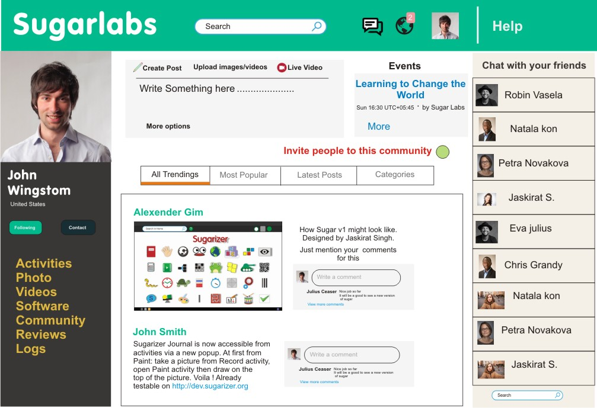

# Sugar Labs Social
## Brief explanation
Sugar Labs Social is a website project which should serve a purpose to help people understand and discuss project(s) around Sugar Labs. The goal of this project is to attract Teachers, Parents, Developers and fully communicate together in one platform. It's a social website that can be used to attract maximum users and everything ( Blogs, New projects, Software, Activities, etc) can be uploaded on it which will attract more user and create their interest. A competitive proposal must include some evidence that the approach taken will result in some use and just because we build it doesn't mean they will come.
## Development of the website
The website needs to be developed from scratch and third party tools such as Wordpress, Joomla, etc. should not be used for developing the website. However, third party services can be used when adding features to the website.

## Content on the website
The following content types should be present on the website.

- Blog posts
- Information on new projects of Sugar Labs
- Information on new Software releases
- Information on new Activities
- News feed

## Required Features and Functionalities
1. User logins such as general email, Gmail, Google Plus, Twitter, Facebook, Github.
2. News feed which displays information such as latest blog posts, latest discussion threads, latest activities, etc which is similar to Twitter's news feed.
3. Blog (medium like) that can be over viewed by people around the world.
4. Discussion forum. Third party services like Disqus, etc. can be used.
5. Interactive chat bot.
7. XML feed format.
8. Chatting among users / DM **(additional functionality)**
9. Follow users such as in Medium, Twitter, etc. **(additional functionality)**

## Knowledge prerequisites
Good Layout designing and coding experience with backend (Django, JavaScript, HTML/CSS, Mongo).

## Tasks which can be done during the proposal period
- Creating design mocks ups of the website
- Preparing a clear overview of the architecture of the project (frontend + backend)

 ### Note
 During the proposal period, we are not expecting any coding part to be done but we expect the above tasks.

## Check out the example below

## Potential Mentors of the project
- Hrishi Patel (Github - [Hrishi](https://github.com/Hrishi1999))(Email - hrishipatel99@gmail.com)
- Samson Goddy (Github - [samswag](https://github.com/samswag))(Email - samsongoddy@gmail.com)
- Seetarama Raju (Github - [geekrypter](https://github.com/geekrypter))(Email - psramaraju@gmail.com)
- Divyanshu Rawat (Email - divyanshu.r46956@gmail.com)

## Happy Coding :)
